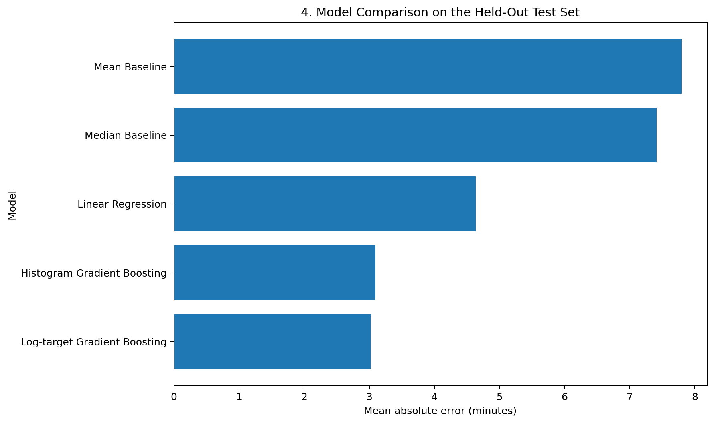
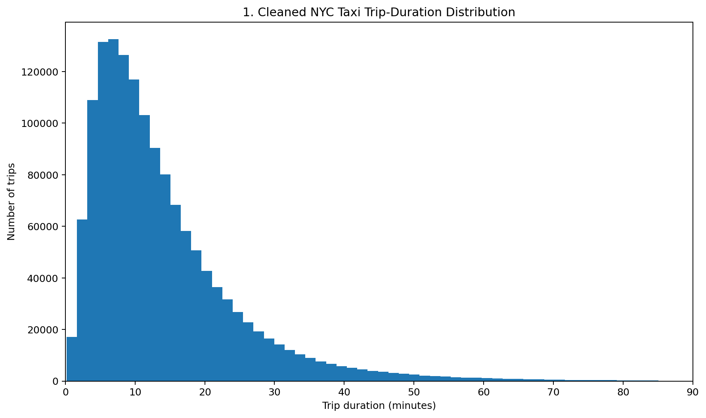
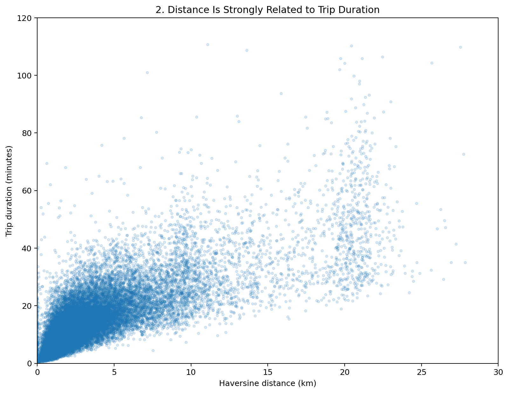
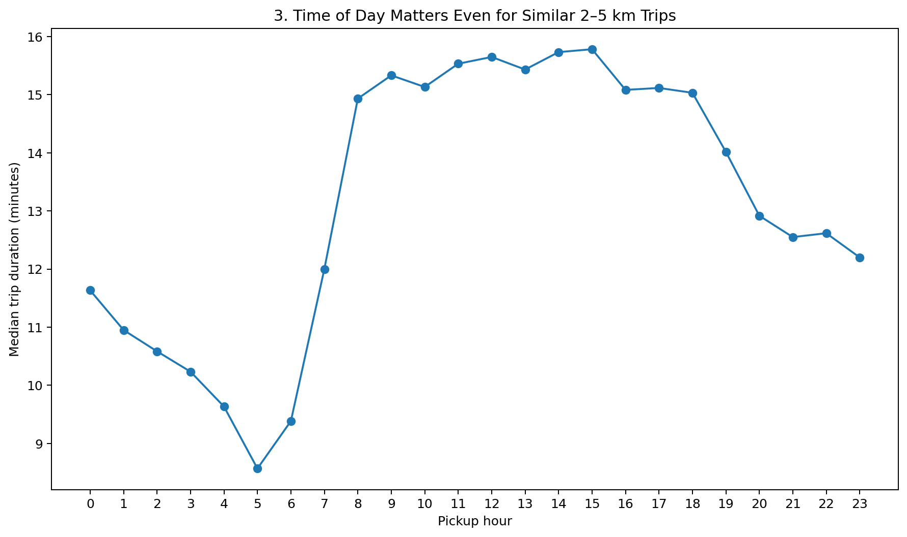
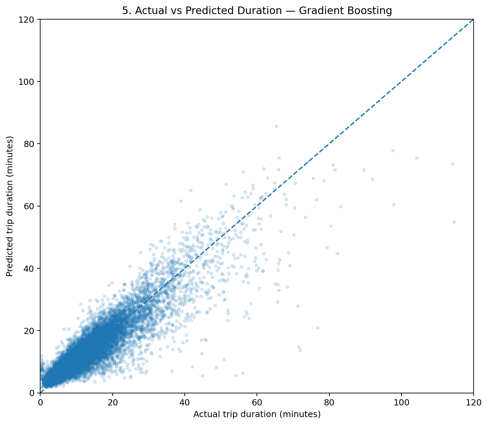
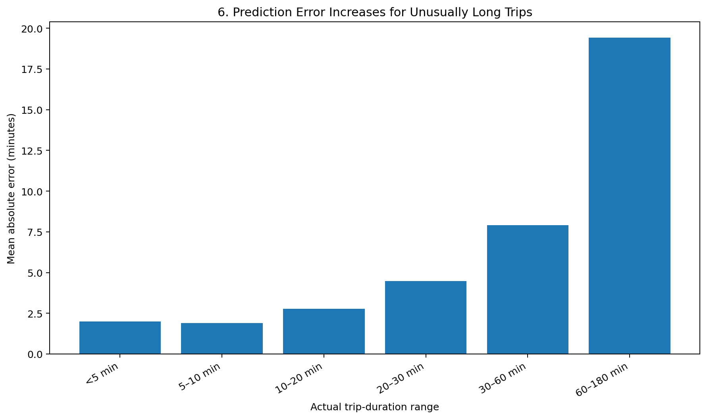
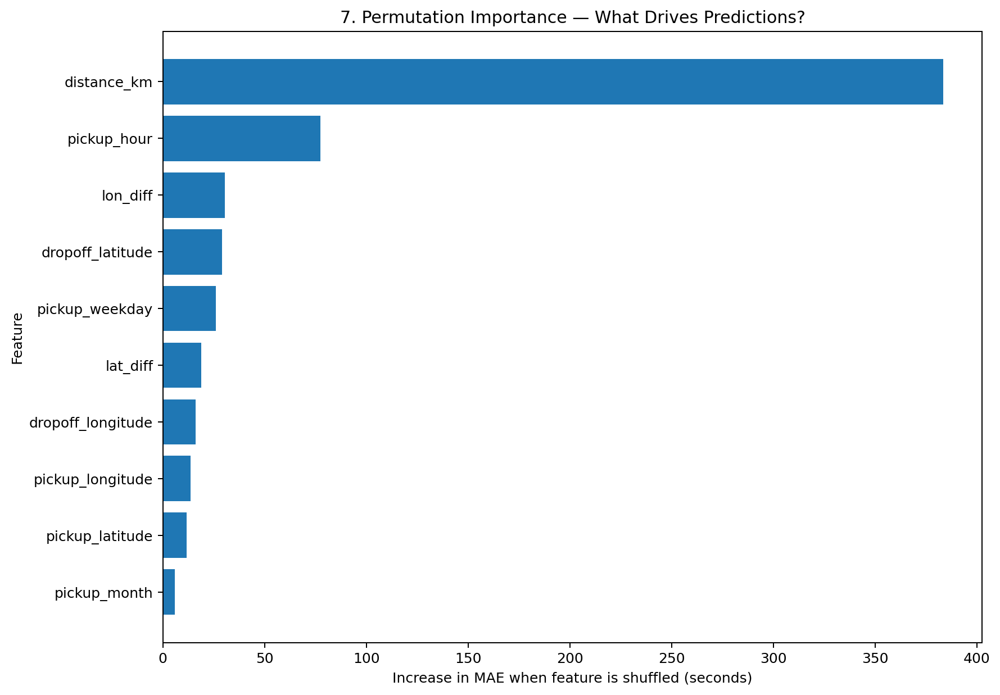

# NYC Taxi Trip Duration — An End-to-End LLM-Driven Data Science Experiment

> **Project question:** Can a language model conduct a complete data-science workflow—from raw dataset inspection through model interpretation—and produce a defensible machine-learning result?

This repository documents an end-to-end regression project using the **NYC Taxi Trip Duration** dataset. The language model guided and executed the analytical workflow in an interactive coding environment: inspecting the uploaded data, identifying quality issues, preventing target leakage, cleaning anomalous records, performing exploratory data analysis, engineering features, training and comparing models, evaluating generalization on held-out data, generating visualizations, and interpreting model behavior.

The goal was not simply to produce the lowest error score. The goal was to demonstrate a **traceable data-science reasoning process**.

---

## Executive Summary

The original dataset contained **1,458,644 taxi trips and 11 columns**.

Key findings:

- **No missing values** were present.
- **No exact duplicate rows** or duplicate trip IDs were found.
- The raw dataset contained extreme duration outliers, a handful of unusual passenger counts, and a small number of coordinates outside the expected NYC region.
- `dropoff_datetime` was identified as a **target-leakage variable** because:

  `dropoff_datetime - pickup_datetime = trip_duration`

- Conservative cleaning removed only **4,446 rows (0.305%)**, leaving **1,454,198 trips**.
- Haversine pickup-to-dropoff distance was strongly related to trip duration, with correlation of approximately **0.77**.
- Pickup time also mattered: even trips of similar distance took substantially longer during daytime periods than in the early morning.
- A median baseline produced an MAE of **7.41 minutes**.
- Linear Regression improved MAE to **4.63 minutes**.
- Histogram Gradient Boosting reduced MAE to **3.10 minutes**, with:
  - **RMSE:** 4.96 minutes
  - **R²:** 0.796
- A log-target Gradient Boosting model achieved the lowest MAE at **3.02 minutes**, although its RMSE and R² were slightly worse.
- The final evaluation showed that the model was strongest on common short-to-medium trips and systematically less accurate on unusually long trips.

### Final verified model comparison

| Model | MAE (min) | RMSE (min) | R² |
|---|---:|---:|---:|
| Median Baseline | 7.41 | 11.37 | -0.072 |
| Mean Baseline | 7.80 | 10.98 | ~0.000 |
| Linear Regression | 4.63 | 6.83 | 0.613 |
| **Histogram Gradient Boosting** | **3.10** | **4.96** | **0.796** |
| **Log-target Gradient Boosting** | **3.02** | 5.08 | 0.787 |



---

# Project Workflow

## Stage 1 — Dataset Inspection

The first task was to understand the dataset before changing anything.

The dataset contained:

| Column | Type | Role |
|---|---|---|
| `id` | object | Unique trip identifier |
| `vendor_id` | int | Vendor category |
| `pickup_datetime` | object → datetime | Pickup timestamp |
| `dropoff_datetime` | object → datetime | Dropoff timestamp |
| `passenger_count` | int | Passenger count |
| `pickup_longitude` | float | Pickup longitude |
| `pickup_latitude` | float | Pickup latitude |
| `dropoff_longitude` | float | Dropoff longitude |
| `dropoff_latitude` | float | Dropoff latitude |
| `store_and_fwd_flag` | object | Transmission flag |
| `trip_duration` | int | **Target variable, in seconds** |

### Data-quality findings

- Missing values: **0**
- Exact duplicate rows: **0**
- Duplicate trip IDs: **0**
- Minimum trip duration: **1 second**
- Maximum trip duration: approximately **40.8 days**
- Passenger counts ranged from **0 to 9**
- A small number of coordinates were far outside NYC

The dataset was structurally complete, but not fully modeling-ready.

### Critical leakage finding

The LLM explicitly verified that `dropoff_datetime - pickup_datetime` exactly reproduced `trip_duration`.

Using `dropoff_datetime` as an input feature would therefore leak the answer into the model. It was retained only for validation and excluded from modeling.

---

## Stage 2 — Data Cleaning

Cleaning rules were deliberately conservative.

### Cleaning rules

1. Convert timestamp columns to datetime.
2. Keep trips longer than 10 seconds and no longer than 3 hours.
3. Keep passenger counts from 1 through 6.
4. Keep pickup and dropoff coordinates inside a broad NYC/nearby bounding region.
5. Do not remove rows for missing values or duplicates because none existed.

### Cleaning outcome

| Metric | Value |
|---|---:|
| Original rows | 1,458,644 |
| Clean rows | 1,454,198 |
| Rows removed | 4,446 |
| Percent removed | **0.305%** |

The median trip duration remained approximately **662 seconds (~11 minutes)** after cleaning, indicating that the process removed extreme anomalies without materially changing the typical trip.

---

## Stage 3 — Exploratory Data Analysis

EDA was used to answer questions rather than generate charts for their own sake.

### 3.1 What does the target distribution look like?

Trip duration is strongly right-skewed. Most taxi rides are relatively short, while a smaller number of much longer rides create a long right tail.



The raw target had skewness of approximately **2.30**. A log transformation reduced it to approximately **-0.37**, motivating a later log-target modeling experiment.

### 3.2 Does distance matter?

A Haversine feature was calculated from the pickup and dropoff coordinates.



The correlation between Haversine distance and trip duration was approximately **0.77**, making distance a strong candidate predictor.

Median duration also increased consistently with distance:

- Under 1 km: ~4.5 min
- 1–2 km: ~7.9 min
- 2–3 km: ~11.8 min
- 3–5 km: ~15.8 min
- 5–10 km: ~22.1 min
- 10–20 km: ~31.9 min
- 20+ km: ~45.5 min

### 3.3 Does time of day matter after roughly controlling for distance?

To reduce the confounding effect of trip length, the analysis isolated trips with Haversine distance between **2 and 5 km**.



Trips of similar distance were fastest in the early morning and substantially slower during the daytime, showing that time contains predictive information beyond distance alone.

Other EDA findings:

- Weekday showed a modest relationship with duration.
- Passenger count showed only small differences.
- Vendor ID showed very little difference.
- `store_and_fwd_flag=Y` was rare and associated with somewhat longer trips, but the feature later proved weak in predictive importance.

---

## Stage 4 — Feature Engineering

The raw dataset was transformed into a model-ready feature matrix.

### Engineered features

- `distance_km` — Haversine straight-line pickup-to-dropoff distance
- `pickup_hour`
- `pickup_weekday`
- `pickup_month`
- `is_weekend`
- `is_rush_hour`
- `lat_diff`
- `lon_diff`
- `manhattan_coord_distance`

Raw geographic coordinates, passenger count, vendor ID, and the store-and-forward flag were also retained.

### Features excluded from modeling

- `id` — identifier only
- `dropoff_datetime` — target leakage
- `trip_duration` — target, not predictor
- raw `pickup_datetime` — replaced by engineered temporal features for the initial models

### Haversine vs simplified Manhattan-coordinate distance

The simplified Manhattan-coordinate feature was defined as:

`abs(latitude difference) + abs(longitude difference)`

It was not true street-network distance. Later permutation importance showed that Haversine distance contributed vastly more predictive information than this simplified approximation.

---

## Stage 5 — Train/Test Split and Baselines

The cleaned feature matrix was divided into:

- **80% training data**
- **20% test data**
- `random_state=42` for reproducibility

The held-out test set contained **290,840 unseen trips**.

Two dummy models established naive baselines:

- Median baseline
- Mean baseline

A Linear Regression model then served as the first genuine predictive model.

This created a performance ladder:

`Dummy baseline → Linear Regression → nonlinear tree-based models`

The median baseline MAE was **7.41 minutes**, while Linear Regression reduced it to **4.63 minutes**.

---

## Stage 6 — Model Training and Comparison

Multiple models were compared on the same held-out test data.


### Results

| Model | MAE (min) | RMSE (min) | R² |
|---|---:|---:|---:|
| Median Baseline | 7.41 | 11.37 | -0.072 |
| Mean Baseline | 7.80 | 10.98 | ~0.000 |
| Linear Regression | 4.63 | 6.83 | 0.613 |
| **Histogram Gradient Boosting** | **3.10** | **4.96** | **0.796** |
| **Log-target Gradient Boosting** | **3.02** | 5.08 | 0.787 |

The raw-target Histogram Gradient Boosting model was selected as the primary model because it had the strongest combined RMSE and R².

The log-target model produced the smallest MAE, demonstrating that compressing the right-skewed target improved typical absolute-error performance at the cost of slightly worse large-error performance.

---

## Stage 7 — Model Evaluation and Interpretation

The primary Gradient Boosting model was evaluated beyond a single metric.

### Generalization metrics

- **MAE:** 3.10 minutes
- **Median absolute error:** ~2.09 minutes
- **RMSE:** 4.96 minutes
- **R²:** 0.796
- **Within ±3 minutes:** ~65.0%
- **Within ±5 minutes:** ~83.4%
- **Within ±10 minutes:** ~95.9%

### Actual vs predicted



Predictions track the diagonal well for the majority of ordinary trips, but the model increasingly underestimates unusually long trips.

### Error by actual trip duration



| Actual trip duration | MAE |
|---|---:|
| <5 min | ~2.0 min |
| 5–10 min | ~1.9 min |
| 10–20 min | ~2.8 min |
| 20–30 min | ~4.5 min |
| 30–60 min | ~7.9 min |
| 60–180 min | ~19.4 min |

The model shows **regression toward typical trip duration**:

- Very short trips tend to be overestimated.
- Very long trips tend to be underestimated.

### Feature importance

Permutation importance measured how much prediction error increased when each feature was shuffled.



The strongest signals were:

1. **Haversine distance**
2. **Pickup hour**
3. Longitude displacement
4. Dropoff latitude
5. Pickup weekday
6. Latitude displacement

Haversine distance dominated the model. Shuffling it increased MAE by roughly **383 seconds (~6.4 minutes)**.

By comparison, the simplified Manhattan-coordinate distance contributed almost no additional predictive value once the other spatial variables were present.

---

## Stage 8 — Conclusions, Limitations, and Recommendations

### Main conclusion

The experiment demonstrates that an LLM can conduct a meaningful end-to-end data-science workflow when it has access to the dataset and an execution environment.

The LLM did more than generate code. It:

- inspected the actual dataset,
- identified target leakage,
- distinguished anomalies from ordinary variation,
- proposed and applied conservative cleaning rules,
- formed hypotheses during EDA,
- engineered features based on those hypotheses,
- created naive and statistical baselines,
- trained nonlinear models,
- compared results on held-out data,
- tested a log-target alternative,
- generated diagnostic visualizations,
- measured feature importance,
- and documented model limitations.

The best overall raw-target model reduced MAE from **7.41 minutes to 3.10 minutes**, a reduction of roughly **58%** relative to the median baseline.

### Important limitations

The available dataset does not directly contain:

- live traffic,
- weather,
- accidents,
- road closures,
- construction,
- exact route traveled,
- true road-network distance,
- traffic-light delays,
- driver behavior.

These missing variables likely explain part of the model's difficulty with unusually long trips.

### Recommended next experiments

1. Use a **time-based validation split** to test future-period generalization.
2. Add **road-network routing distance and estimated travel time**.
3. Add **weather and historical traffic data**.
4. Add spatial clusters or neighborhood features.
5. Tune Gradient Boosting hyperparameters systematically.
6. Compare XGBoost, LightGBM, or CatBoost if permitted.
7. Remove weak/redundant features and evaluate whether performance remains stable.
8. Calibrate or separately model unusually long trips.

---

# Why This Project Demonstrates LLM-Based Data Science

The strongest evidence is the continuity between stages:

### Example 1 — Data leakage

**Inspection:** `dropoff_datetime` exactly revealed the target.  
**Decision:** Exclude it from prediction.  
**Impact:** Prevented an artificially perfect and invalid model.

### Example 2 — Distance

**EDA:** Distance showed a strong relationship with duration.  
**Feature engineering:** Haversine distance was created.  
**Model interpretation:** Haversine distance became the most important feature.

### Example 3 — Time

**EDA:** Similar-distance trips varied substantially by pickup hour.  
**Feature engineering:** Pickup-hour and temporal variables were added.  
**Interpretation:** Pickup hour became the second-most-important feature.

### Example 4 — Model complexity

**Baseline:** Median MAE = 7.41 min.  
**Linear model:** MAE = 4.63 min.  
**Nonlinear model:** MAE = 3.10 min.  

The model comparison demonstrates that increasing model flexibility captured real nonlinear structure rather than merely producing a different algorithm.

---

# Repository Structure

```text
nyc_taxi_llm_project/
├── README.md
├── MEDIUM_ARTICLE.md
├── PRESENTATION_NARRATIVE.md
├── assets/
│   ├── 01_trip_duration_distribution.png
│   ├── 02_distance_vs_duration.png
│   ├── 03_hourly_duration_similar_distance.png
│   ├── 04_model_mae_comparison.png
│   ├── 05_actual_vs_predicted.png
│   ├── 06_error_by_duration_band.png
│   └── 07_permutation_feature_importance.png
└── results/
    ├── model_results_verified.csv
    ├── duration_band_errors.csv
    ├── hour_errors.csv
    └── permutation_importance.csv
```

---

# Supporting Artifacts

- [Medium-style project article](MEDIUM_ARTICLE.md)
- [Presentation narrative / speaker notes](PRESENTATION_NARRATIVE.md)
- [Verified model results](results/model_results_verified.csv)
- [Duration-band error analysis](results/duration_band_errors.csv)
- [Permutation feature importance](results/permutation_importance.csv)

---

# Final Takeaway

This project supports the assignment hypothesis:

> **A language model, given access to data and an execution environment, can perform the major reasoning and implementation stages of a real data-science workflow—not merely write isolated code snippets.**

The resulting model is not production-perfect, but the experiment is reproducible, quantitatively evaluated, visually interpretable, and explicit about its limitations.
